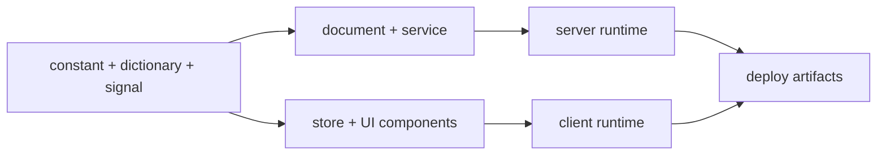

# Akan.js

[한국어](https://unpkg.com/akanjs@latest/README.ko.md) | [Docs](https://akanjs.com/docs) | [npm](https://www.npmjs.com/package/akanjs)

**Write the business, not the plumbing.**

Akan.js is a Bun-first full-stack TypeScript framework for teams that want business definitions to be the
application. One cohesive codebase can produce SEO web surfaces, iOS and Android app surfaces, servers,
database contracts, infrastructure artifacts, and documentation.

```bash
bunx create-akan-workspace@latest
```

## Why Akan

Akan is designed for teams and solo builders who would rather describe what the business does than keep
rewriting the same intent for each technical layer. Define the domain once, then let the framework connect
the schema, API, fetch client, store, UI, server, deployment artifacts, and generated references.

- **Agents write**: business definitions are the source of truth; generation handles repetitive framework code.
- **Keep it minimal**: one line of intent can flow across web, app, server, database, and deployment.
- **Always readable**: fewer files, strict conventions, and predictable declarations keep code clear months later.
- **Nice to review**: focused domain changes are easier to inspect, approve, and ship.

## Requirements

- [Bun](https://bun.sh) `>=1.3.13`
- TypeScript-first application code
- React-based UI surfaces

## Quick Start

Create a workspace directly:

```bash
bunx create-akan-workspace@latest
```

Or install the CLI globally:

```bash
bun install -g akanjs --latest
akan create-workspace
cd <workspace-name>
akan start <app-name> --open
```

A minimal app can start with almost no configuration:

```ts
import type { AppConfig } from "akanjs";

const config: AppConfig = {};

export default config;
```

Production apps can grow into routes, base paths, domains, mobile metadata, and deployment options through
`akan.config.ts`.

## Readable By Design

Akan keeps long-lived applications understandable by making the important decisions explicit and repeatable.

- **One configuration surface**: `akan.config.ts` is the app-level control plane. It can stay empty until the
  app actually needs routes, domains, base paths, mobile settings, or deployment options.
- **Monorepo-native reuse**: shared libraries and domain modules are first-class, so validated business code can
  be reused without rebuilding the same wheel in each app.
- **Strict structure, familiar code**: file locations, names, declarations, and module boundaries follow the same
  pattern across the workspace, so code written by another contributor still reads like local code.

## The Domain Module

The domain module is the center of Akan development. Instead of organizing code by technical layer first,
Akan organizes code around business domains such as `user`, `product`, `ticket`, or `project`.

```text
lib/product/
├── product.constant.ts    # model, scalar, enum, schema definition
├── product.dictionary.ts  # i18n labels, descriptions, errors
├── product.signal.ts      # typed endpoint contract
├── product.document.ts    # persistence and document queries
├── product.service.ts     # business logic
├── product.store.ts       # domain state and actions
├── Product.Template.tsx   # form-oriented UI
├── Product.Unit.tsx       # list/item UI
├── Product.View.tsx       # detail UI
└── Product.Zone.tsx       # page/container UI
```



This structure lets one model and one contract flow through the database, server, API, state management,
and UI without duplicating intent across layers.

## What Akan Builds

Akan is one framework for the pieces that normally become separate projects:

- SEO-optimized server-side rendered web surfaces.
- iOS and Android friendly client-side rendered app surfaces with page transitions.
- Bun-powered HTTP and WebSocket servers.
- SQLite-first simple server paths, with Postgres and Redis expansion paths for larger systems.
- Schema validation, error handling, security helpers, and middleware.
- Type-safe flow from database schema to server, API, state, and UI.
- Internationalized schemas, errors, API descriptions, and UI copy.
- Generated database and API documentation from the same definitions that run the app.
- Composable feature blocks for upload, authentication, admin, chat, boards, and notifications.

Deployment and documentation should not consume a day of work. Akan is built so schema and endpoint
definitions can also become table references, runtime contracts, API docs, and testable endpoint references.

## One Package, Many Boundaries

Akan is published as a single npm package: `akanjs`.

The root import is intentionally small. Use subpath imports to keep server-only, client-only, UI, and
tooling surfaces clear:

```ts
import { Int, dayjs } from "akanjs/base";
import { via } from "akanjs/constant";
import { endpoint } from "akanjs/signal";
import { fetch } from "akanjs/fetch";
import { Button, Layout } from "akanjs/ui";
import type { PageConfig } from "akanjs/client";
```

```css
@import "akanjs/ui/styles.css";
```

This model keeps install and update flows simple while preserving runtime boundaries and allowing the
frontend build to rewrite UI barrel imports into leaf imports.

## Package Surface

| Subpath | Purpose |
| --- | --- |
| `akanjs/base` | Core primitives, scalar helpers, environment helpers, symbols, and common types. |
| `akanjs/common` | Shared cross-runtime helpers used by multiple Akan surfaces. |
| `akanjs/constant` | Model declarations, schema shaping, serialization, defaults, and the `via` builder. |
| `akanjs/dictionary` | Locale, translation, and dictionary helpers for natural-language metadata. |
| `akanjs/document` | Database document schemas, query builders, loaders, and persistence utilities. |
| `akanjs/signal` | Endpoint, slice, guard, middleware, serializer, and typed signal contracts. |
| `akanjs/service` | Service modules, adaptors, dependency injection metadata, and business logic runtime. |
| `akanjs/fetch` | Typed fetch clients, HTTP clients, WebSocket clients, and request storage. |
| `akanjs/store` | Domain state, actions, store registry, and root-store helpers. |
| `akanjs/ui` | React components and UI primitives such as layout, form, modal, table, loading, and model views. |
| `akanjs/client` | Client routing, cookies, storage, locale, device, CSR types, and page helpers. |
| `akanjs/client` | Client bootstrapping and location helpers used by Akan page runtimes. |
| `akanjs/server` | Server app runtime, route composition, SSR/RSC artifacts, proxying, sitemap, and server types. |
| `@akanjs/devkit` | Build runners, config loaders, code generation, scanners, transforms, CLI helpers, and tooling. |
| `akanjs/test` | Test helpers and sample generation utilities. |
| `@akanjs/cli` | Programmatic CLI entrypoint. The executable command is `akan`. |

Special public surfaces:

- `akanjs/ui/styles.css`
- `akanjs/capacitor.base.config`
- `akanjs/server/rsc-worker`
- `akanjs/package.json`

## CLI Overview

The `akan` command manages the whole workspace lifecycle.

```bash
akan create-workspace
akan create-application <app-name>
akan create-module
akan create-scalar
akan start <app-name> --open
akan build <app-name>
akan lint-all
akan update
```

Common areas:

- **Workspace**: create workspaces, generate Mongo configuration, lint and sync projects.
- **Application**: start, build, typecheck, package, and release apps.
- **Library**: create, install, sync, push, and pull shared libraries.
- **Module and scalar**: generate domain modules, models, views, units, templates, and stores.
- **Cloud and release**: prepare deployment assets and update Akan package versions.
- **Guidelines**: generate and inspect framework coding guidelines for agents and contributors.

## Application Configuration

`akan.config.ts` is the single place for app-level configuration. It can be empty for simple apps, then
grow only when the app needs routes, domains, base paths, or mobile settings.

```ts
import type { AppConfig } from "akanjs";

const config: AppConfig = {
  routes: [
    { domains: { main: ["example.com", "www.example.com"] }, basePath: "web" },
    { domains: {}, basePath: "app" },
  ],
  mobile: {
    appName: "Example",
    appId: "com.example.app",
    version: "1.0.0",
    buildNum: 1,
  },
};

export default config;
```

## Contributor Notes

This repository is a Bun-first monorepo. Framework code lives under `pkgs/akanjs`, applications under
`apps`, shared libraries under `libs`, and deployment assets under `infra`.

Useful commands:

```bash
akan lint-all --fix=false
akan build <appName>
akan start <appName>
```

When editing framework code, prefer established subpaths and keep the root `akanjs` entrypoint small.
The package boundary is part of the runtime design.

## Open Source Notes

- License: MIT. See the root `LICENSE`.
- Repository: [akan-team/akanjs](https://github.com/akan-team/akanjs).
- Contribution guide: see the root `CONTRIBUTING.md`.
- Code of conduct: see the root `CODE_OF_CONDUCT.md`.
